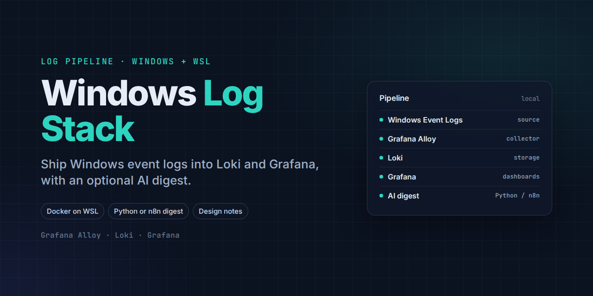
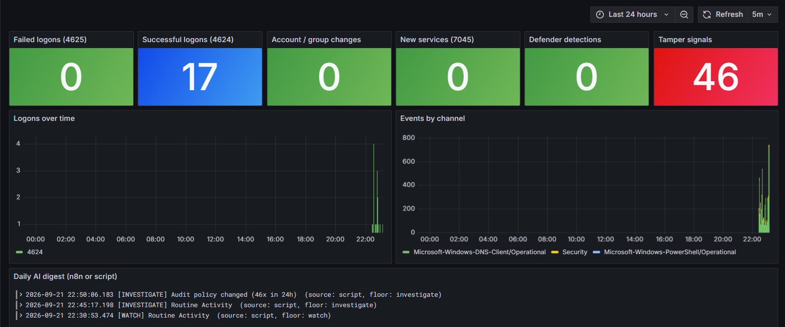

# Windows Log Stack: Alloy → Loki → Grafana (+ optional AI digest)

[](https://github.com/garynair/windows-log-analysis/actions/workflows/ci.yml)

Security monitoring for a single Windows machine that keeps every log on the machine. Grafana Alloy ships selected Security, System, Defender, PowerShell and DNS events to Loki in WSL, and a Grafana dashboard shows logons, account changes, tamper signals and AI services seen in DNS. A daily digest uses a local model to summarize the last 24 hours. Deterministic rules set a minimum severity the model can raise but never lower.

**Who it's for:** analysts, GRC practitioners and home-lab users who want Windows security visibility and an AI summary without sending logs to a cloud service. It is a single-host lab setup, not a SIEM.



```
WINDOWS                        WSL (Docker)                         DIGEST (pick one)
Event Logs ─► Grafana Alloy ─► Loki :3100 ─► Grafana :3001          A) digest/windows_digest.py  (no n8n)
 (service)    (localhost push)     ▲                                B) n8n workflow              (with n8n)
                                   └──── job="ai_digest" ◄── both write the daily digest back to Loki
```

## 1. Windows: enable the right logs (Admin PowerShell, once)
```powershell
powershell -ExecutionPolicy Bypass -File .\windows\enable-auditing.ps1
```

## 2. WSL: start Loki + Grafana
```bash
cp .env.example .env && nano .env          # set a real GRAFANA_ADMIN_PASSWORD
docker compose up -d
curl -s localhost:3100/ready               # -> ready (may take ~15s)
python3 scripts/healthcheck.py             # Loki, Grafana, data source, dashboard, recent data
```
Both ports are bound to `127.0.0.1`: Windows reaches them through WSL localhost forwarding, and nothing else on the network can.
Grafana: http://localhost:3001 → Dashboards → Security → **Windows Security Overview**

## 3. Windows: install Grafana Alloy
1. Download `alloy-installer-windows-amd64.exe` from github.com/grafana/alloy/releases (latest) and install.
2. Copy `alloy\config.alloy` over `C:\Program Files\GrafanaLabs\Alloy\config.alloy`.
3. Admin PowerShell: `Restart-Service Alloy`
4. Check http://localhost:12345 — every `loki.source.windowsevent` component should be healthy.
5. Within ~1 minute, panels in Grafana start filling.

## 4a. Digest WITHOUT n8n
```bash
python3 digest/windows_digest.py          # prints the digest and pushes it to Loki
```
Schedule: `crontab -e` → `0 7 * * * /usr/bin/python3 /home/<you>/windows-log-stack/digest/windows_digest.py >> /tmp/digest.log 2>&1`
(cron only runs while WSL is up; alternative is Windows Task Scheduler running
`wsl -d Ubuntu-24.04 -- python3 /home/<you>/windows-log-stack/digest/windows_digest.py`).

## 4b. Digest WITH n8n
1. Put your n8n container on the stack's network so it can reach Loki as `http://loki:3100`:
   `docker network connect winlogs_default <your-n8n-container>`
2. n8n → ⋯ → Import from File → `n8n/windows_log_digest_workflow.json`
3. Open **Ollama llama3.2:3b** node → select your existing Ollama credential.
4. Execute workflow once manually; then Publish to run daily at 7 AM.

Both paths write to `{job="ai_digest"}` → the **Daily AI digest** panel shows whichever you use. They apply the same rules and produce the same severity, reasons and headline; the tests below keep them in step.

## What the digest rules do

| Events in the last 24h | Minimum severity |
|---|---|
| Security or System log cleared (1102, 104), audit policy changed (4719), Defender real-time protection disabled (5001) | `investigate` |
| Account or group changes, lockouts, new services, Defender detections or config changes | `watch` |
| Any event type at 5+ per day and more than twice its baseline (needs 3 days of history) | `watch` |
| Nothing above | `info` |

When the rules raise the model's severity, the headline is replaced with the most serious rule reason, and a specific recommended check is added for each reason. If the model is down or returns invalid JSON, the digest is still published with the rule results.

## Design notes
- **Severity floor:** deterministic rules (log cleared, audit policy changed, Defender disabled → *investigate*;
  account/group changes, new services, detections, spikes → *watch*) can raise the LLM's severity, never lower it.
- **Data stays local:** logs, Loki, and the model are all on this laptop. Don't point the digest at a cloud LLM —
  4688 command lines can contain secrets.
- **Retention:** 30 days (`loki/loki-config.yaml` → `retention_period`).
- **Images are pinned** to known-good versions; update tags once the stack works.

## Validation

| Check | What it proves | Run |
|---|---|---|
| `tests/test_digest.py` | Severity floor, reasons, checks, spike baseline and warm-up, headline override, bad or missing model output (Python digest) | `python3 -m unittest discover -s tests` |
| `tests/n8n.test.mjs` | The n8n workflow's code nodes give the same results for the same cases (`tests/scenarios.json`), and its wiring is valid | `node --test` |
| `scripts/smoke_test.sh` | Starts from a running stack, pushes synthetic Windows events, runs the digest without a model and confirms the result lands in Loki | `./scripts/smoke_test.sh` |
| `scripts/healthcheck.py` | Loki and Grafana are up, provisioning loaded, events and digests are recent | `python3 scripts/healthcheck.py` |

GitHub Actions runs all four on every push. The tests do not judge the quality of the model's summary; read the digest against the raw events.

## Tested with

| Component | Version |
|---|---|
| Windows | 11 Pro (build 26200) |
| WSL / Ubuntu | WSL 2.7.14, Ubuntu 24.04 |
| Docker Engine | 29.1.3 |
| Grafana Alloy (Windows) | 1.19.2 |
| Loki / Grafana | 3.4.2 / 11.5.2 (pinned) |
| n8n | 2.38.7 |
| Ollama / model | 0.32.15 / llama3.2:3b |
| Python | 3.12 (standard library only) |

## Security considerations

| Risk | Control |
|---|---|
| Loki has no authentication | Ports bound to `127.0.0.1`; never publish 3100 beyond the host |
| 4688 command lines can contain secrets | Logs, Loki and the model stay local; don't point the digest at a cloud LLM |
| Log content reaches the model (e.g., a malicious service name) | Event text is passed as data; the rule floor can't be lowered by the model |
| Grafana admin account | Password required from `.env` (compose refuses to start without it); sign-up disabled |
| Tampering on the host | Log-cleared and audit-policy events force `investigate`; an attacker with admin rights can still stop Alloy |

## Known weak spots
- If WSL is stopped, Alloy retries then **drops** events (its bookmark still advances). Keep WSL running while collecting.
- The DNS panels extract names with a regex on the event message; if they're empty but `{channel="Microsoft-Windows-DNS-Client/Operational"}` has logs,
  the message format differs — adjust the regex in the two DNS panels.
- 4624/4672/4688 are high-volume by nature; fine for one laptop, too noisy to ship as-is to a shared SIEM.
